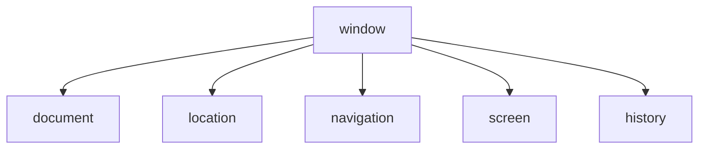

##  BOM

​	BOM（Browser Object Model）即浏览器对象模型，它提供了独立于内容而与浏览器窗口进行交互的对象，其核心对象是 window。

​	BOM 由一系列相关的对象构成，并且每个对象都提供了很多方法与属性。

​	BOM 缺乏标准，JavaScript 语法的标准化组织是 ECMA，DOM 的标准化组织是 W3C，BOM 最初是Netscape 浏览器标准的一部分。

**DOM**

- 文档对象模型
- DOM就是把「文档」当做一个「对象」来看待
- DOM的顶级对象是document
- DOM主要学习的是操作页面元素DOM是W3C标准规范


**BOM**

- 浏览器对象模型
- 把「浏览器」当做一个「对象」来看待
- BOM的顶级对象是window
- BOM学习的是浏览器窗口交互的一些对象
- BOM是浏览器厂商在各自浏览器上定义的，兼容性较差

### BOM的构成

>  BOM 比 DOM 更大，它包含 DOM。




### 顶级对象window

**window对象是浏览器的顶级对象，它具有双重角色**。
1．它是JS访问浏览器窗口的一个接口。
2．它是一个全局对象。定义在全局作用域中的变量、函数都会变成window对象的属性和方法。

在调用的时候可以省略window，前面学习的对话框都属于window对象方法，如alert()、prompt()等。
注意: window下的一个特殊属性window.name

### window对象的常见事件

#### 页面（窗口）加载事件（2种）

**第1种**

```js
window.onload = function () { }
// 或者
window.addEventListener ("load" , function ( ) { });
```

`window.onload `是窗口 (页面）加载事件，**当文档内容完全加载完成**会触发该事件(包括图像、脚本文件、CSS 文件等), 就调用的处理函数。

**注意:**

1. 有了window.onload就可以把JS代码写到页面元素的上方，因为onload是等页面内容全部加载完毕，再去执行处理函数。
2. window.onload传统注册事件方式只能写一次，如果有多个，会以最后一个window.onload为准。
3. 如果使用addEventListener则没有限制

**第2种**

```js
document.addEventListener ( ' DOMContentLoaded' , function() { })
```

​	DOMContentLoaded 事件触发时，仅当DOM加载完成，不包括样式表，图片，flash等等。

​	IE9以上才支持！！！

​	如果页面的图片很多的话, 从用户访问到onload触发可能需要较长的时间, 交互效果就不能实现，必然影响用户的体验，此时用 DOMContentLoaded 事件比较合适。

```js
<script>
    window.addEventListener('load', function() {
        var btn = document.querySelector('button');
        btn.addEventListener('click', function() {
            alert('点击我');
        })
    })
    window.addEventListener('load', function() {
        alert(22);
    })
    document.addEventListener('DOMContentLoaded', function() {
        alert(33);
    })
</script>
```

#### 调整窗口大小事件

```js
window. onresize = function ( ) { }
window.addEventListener ( "resize" , function ( ) { });
```

​	`window.onresize` 是调整窗口大小加载事件,  当触发时就调用的处理函数。

注意：

1. 只要窗口大小发生像素变化，就会触发这个事件。

2. 我们经常利用这个事件完成响应式布局。 window.innerWidth 当前屏幕的宽度

```js
<script>
    // 注册页面加载事件
    window.addEventListener('load', function() {
        var div = document.querySelector('div');
        // 注册调整窗口大小事件
        window.addEventListener('resize', function() {
            // window.innerWidth 获取窗口大小
            console.log('变化了');
            if (window.innerWidth <= 800) {
                div.style.display = 'none';
            } else {
                div.style.display = 'block';
            }
        })
    })
</script>
<div></div>
```


### 定时器（两种）

window 对象给我们提供了 2 个非常好用的方法-定时器。

- setTimeout() 

- setInterval()  

#### setTimeout() 炸弹定时器

##### 开启定时器


```js
window.setTimeout(调用函数，[延迟的毫秒数]) ;
```

setTimeout()这个调用函数我们也称为回调函数callback
**注意:**

1. window可以省略。
2. 这个调用函数可以直接写函数，或者写函数名或者采取字符串‘函数名()'三种形式。第三种不推荐
3. 延迟的毫秒数省略默认是0，如果写，必须是毫秒。
4. 因为定时器可能有很多，所以我们经常给定时器赋值一个标识符。

> 普通函数是按照代码顺序直接调用。
>
> 简单理解： 回调，就是回头调用的意思。上一件事干完，再回头再调用这个函数。
> 例如：定时器中的调用函数，事件处理函数，也是回调函数。
>
> 以前我们讲的   element.onclick = function(){}   或者  element.addEventListener(“click”, fn);   里面的 函数也是回调函数。

```js
<script>
    // 回调函数是一个匿名函数
     setTimeout(function() {
         console.log('时间到了');

     }, 2000);
    function callback() {
        console.log('爆炸了');
    }
    // 回调函数是一个有名函数
    var timer1 = setTimeout(callback, 3000);
    var timer2 = setTimeout(callback, 5000);
</script>
```

##### 停止定时器

```js
window.clearTimeout (timeoutID)
```


clearTimeout()方法取消了先前通过调用setTimeout (）建立的定时器。
注意:

1. window可以省略。
2. 里面的参数就是定时器的标识符。

```js
<button>点击停止定时器</button>
<script>
    var btn = document.querySelector('button');
    // 开启定时器
    var timer = setTimeout(function() {
        console.log('爆炸了');
    }, 5000);
    // 给按钮注册单击事件
    btn.addEventListener('click', function() {
        // 停止定时器
        clearTimeout(timer);
    })
</script>
```


#### setInterval() 闹钟定时器

##### 开启定时器

```js
window.setInterval(回调函数，[间隔的毫秒数]) ;
```


setInterval)方法重复调用一个函数，每隔这个时间，就去调用一次回调函数。
注意:

1. window可以省略。
2. 这个调用函数可以直接写函数，或者写函数名或者采取字符串'函数名('三种形式。
3. 间隔的毫秒数省略默认是0，如果写，必须是毫秒，表示每隔多少毫秒就自动调用这个函数。
4. 因为定时器可能有很多，所以我们经常给定时器赋值一个标识符。
5. 第一次执行也是间隔毫秒数之后执行，之后每隔毫秒数就执行—次。

```js
<script>
    // 1. setInterval 
    setInterval(function() {
        console.log('继续输出');
    }, 1000);
</script>
```

##### 停止定时器

```js
window.clearInterval ( intervalID);
```


clearInterval()方法取消了先前通过调用setInterval()建立的定时器。
注意:

1. window可以省略。
2. 里面的参数就是定时器的标识符。

### location对象

window对象给我们提供了一个location属性用于获取或设置窗体的URL，并且可以用于解析URL。因为这个属性返回的是一个对象，所以我们将这个属性也称为location对象。

#### URL

统一资源定位符(Uniform Resource Locator,URL)是互联网上标准资源的地址。互联网上的每个文件都有一个唯一的URL，它包含的信息指出文件的位置以及浏览器应该怎么处理它。
URL的一般语法格式为:

```js
protocol:// host [:port]/path/ [?query]#fragment
http : / / www.itcast.cn/index.html ?name=andy&age=18#link
```

| 组成 说明 |                                                              |
| --------- | ------------------------------------------------------------ |
| protocol  | 通信协议常用的http,ftp,maito等                               |
| host      | 主机(域名) www.itheima.com                                   |
| port      | 端☐号可选,省略时使用方案的默认端☐如http的默认端☐为80         |
| path      | 路径由零或多个/符号隔开的字符串,一般用来表示主机上的一个目录或文件地址 |
| query     | 参数以键值对的形式,通过&符号分隔开来                         |
| fragment  | 片段#后面内容常见于链接锚点                                  |

#### location 对象的属性

| location对象属性  | 返回值                          |
| ----------------- | ------------------------------- |
| location.href     | 获取或者设置整个URL             |
| location. host    | 返回主机(域名)www.itheima.com   |
| location.port     | 返回端☐号如果未写返回空字符串   |
| location.pathname | 返回路径                        |
| location. search  | 返回参数                        |
| location. hash    | 返回片段#后面内容常见于链接锚点 |


**重点记住: `href`和`search`**

#### location对象的常见方法

| location对象方法   | 返回值                                                       |
| ------------------ | ------------------------------------------------------------ |
| location.assign()  | 跟href一样,可以跳转页面(也称为重定向页面)                    |
| location.replace() | 替换当前页面,因为不记录历史,所以不能后退页面                 |
| location.reload()  | 重新加载页面,相当于刷新按钮或者f5如果参数为true 强制刷新ctrl+f5 |

```js
<button>点击</button>
<script>
    var btn = document.querySelector('button');
    btn.addEventListener('click', function() {
        // 记录浏览历史，所以可以实现后退功能
        // location.assign('http://www.itcast.cn');
        // 不记录浏览历史，所以不可以实现后退功能
        // location.replace('http://www.itcast.cn');
        location.reload(true);
    })
</script>
```

### navigator对象

navigator 对象包含有关浏览器的信息，它有很多属性，我们最常用的是 userAgent，该属性可以返回由客户机发送服务器的 user-agent 头部的值。

下面前端代码可以判断用户那个终端打开页面，实现跳转

```js
if((navigator.userAgent.match(/(phone|pad|pod|iPhone|iPod|ios|iPad|Android|Mobile|BlackBerry|IEMobile|MQQBrowser|JUC|Fennec|wOSBrowser|BrowserNG|WebOS|Symbian|Windows Phone)/i))) {
    window.location.href = "";     //手机
 } else {
    window.location.href = "";     //电脑
 }
```

### history对象

window对象给我们提供了一个 history对象，与浏览器历史记录进行交互。该对象包含用户（在浏览器窗口中）访问过的URL。

| history对象方法 | 作用                                                  |
| --------------- | ----------------------------------------------------- |
| back()          | 可以后退功能                                          |
| forward()       | 前进功能                                              |
| go(参数)        | 前进后退功能参数如果是1前进1个页面如果是-1后退1个页面 |

history对象一般在实际开发中比较少用，但是会在一些 OA 办公系统中见到。

## screen

### 元素偏移量 offset 系列

#### offset 概述 

offset 翻译过来就是偏移量， 我们使用 offset系列相关属性可以动态的得到该元素的位置（偏移）、大小等。

1. 获得元素距离带有定位父元素的位置

2. 获得元素自身的大小（宽度高度）

3. 注意：返回的数值都不带单位

   | offset系列属性       | 作用                                                         |
   | -------------------- | ------------------------------------------------------------ |
   | element.offsetParent | 返回作为该元素带有定位的父级元素如果父级都没有定位则返回body |
   | element.offsetTop    | 返回元素相对带有定位父元素上方的偏移                         |
   | element.offsetLeft   | 返回元素相对带有定位父元素左边框的偏移                       |
   | element.offsetWidth  | 返回自身包括padding、边框、内容区的宽度,返回数值不带单位     |
   | element.offsetHeight | 返回自身包括padding、边框、内容区的高度,返回数值不带单位     |


#### offset 与 style 区别 

##### offset

- offset 可以得到任意样式表中的样式值

- offset 系列获得的数值是没有单位的

- offsetWidth 包含padding+border+width

- offsetWidth 等属性是只读属性，只能获取不能赋值

- > 所以，我们想要获取元素大小位置，用offset更合适

##### style

- style 只能得到行内样式表中的样式值

- style.width 获得的是带有单位的字符串

- style.width 获得不包含padding和border 的值

- style.width 是可读写属性，可以获取也可以赋值

- > 所以，我们想要给元素更改值，则需要用style改变

> **因为平时我们都是给元素注册触摸事件，所以重点记住 targetTocuhes**

#### 案例：获取鼠标在盒子内的坐标

1. 我们在盒子内点击，想要得到鼠标距离盒子左右的距离。
2. 首先得到鼠标在页面中的坐标（e.pageX, e.pageY）
3. 其次得到盒子在页面中的距离 ( box.offsetLeft, box.offsetTop)
4. 用鼠标距离页面的坐标减去盒子在页面中的距离，得到 鼠标在盒子内的坐标
5. 如果想要移动一下鼠标，就要获取最新的坐标，使用鼠标移动

```javascript
var box = document.querySelector('.box');
box.addEventListener('mousemove', function(e) {
var x = e.pageX - this.offsetLeft;
var y = e.pageY - this.offsetTop;
this.innerHTML = 'x坐标是' + x + ' y坐标是' + y;
})
```

#### 案例：模态框拖拽

弹出框，我们也称为模态框。

​	1.点击弹出层，会弹出模态框， 并且显示灰色半透明的遮挡层。

​	2.点击关闭按钮，可以关闭模态框，并且同时关闭灰色半透明遮挡层。

​	3.鼠标放到模态框最上面一行，可以按住鼠标拖拽模态框在页面中移动。

​	4.鼠标松开，可以停止拖动模态框移动

#### 案例分析:

1. 点击弹出层， 模态框和遮挡层就会显示出来 display:block;
2. 点击关闭按钮，模态框和遮挡层就会隐藏起来 display:none;
3. 在页面中拖拽的原理：鼠标按下并且移动， 之后松开鼠标
4. 触发事件是鼠标按下mousedown，鼠标移动mousemove 鼠标松开 mouseup
5. 拖拽过程:  鼠标移动过程中，获得最新的值赋值给模态框的left和top值，这样模态框可以跟着鼠标走了
6. 鼠标按下触发的事件源是最上面一行，就是  id 为 title 
7. 鼠标的坐标减去 鼠标在盒子内的坐标， 才是模态框真正的位置。
8. 鼠标按下，我们要得到鼠标在盒子的坐标。
9. 鼠标移动，就让模态框的坐标  设置为  ：鼠标坐标 减去盒子坐标即可，注意移动事件写到按下事件里面。
10. 鼠标松开，就停止拖拽，就是可以让鼠标移动事件解除  

```javascript
 // 1. 获取元素
        var login = document.querySelector('.login');
        var mask = document.querySelector('.login-bg');
        var link = document.querySelector('#link');
        var closeBtn = document.querySelector('#closeBtn');
        var title = document.querySelector('#title');
        // 2. 点击弹出层这个链接 link  让mask 和login 显示出来
        link.addEventListener('click', function() {
                mask.style.display = 'block';
                login.style.display = 'block';
            })
            // 3. 点击 closeBtn 就隐藏 mask 和 login 
        closeBtn.addEventListener('click', function() {
                mask.style.display = 'none';
                login.style.display = 'none';
            })
            // 4. 开始拖拽
            // (1) 当我们鼠标按下， 就获得鼠标在盒子内的坐标
        title.addEventListener('mousedown', function(e) {
            var x = e.pageX - login.offsetLeft;
            var y = e.pageY - login.offsetTop;
            // (2) 鼠标移动的时候，把鼠标在页面中的坐标，减去 鼠标在盒子内的坐标就是模态框的left和top值
            document.addEventListener('mousemove', move)

            function move(e) {
                login.style.left = e.pageX - x + 'px';
                login.style.top = e.pageY - y + 'px';
            }
            // (3) 鼠标弹起，就让鼠标移动事件移除
            document.addEventListener('mouseup', function() {
                document.removeEventListener('mousemove', move);
            })
        })

```


### 元素可视区 client 系列

#### client概述

client 翻译过来就是客户端，我们使用 client 系列的相关属性来获取元素可视区的相关信息。通过 client
系列的相关属性可以动态的得到该元素的边框大小、元素大小等。

| client系列属性       | 作用                                                        |
| -------------------- | ----------------------------------------------------------- |
| element.clientTop    | 返回元素上边框的大小                                        |
| element.clientLeft   | 返回元素左边框的大小                                        |
| element.clientWidth  | 返回自身包括padding、内容区的宽度,不含边框,返回数值不带单位 |
| element.clientHeight | 返回自身包括padding、内容区的高度,不含边框,返回数值不带单位 |


### 元素滚动 scroll 系列

#### scroll 概述

scroll 翻译过来就是滚动的，我们使用 scroll 系列的相关属性可以动态的得到该元素的大小、滚动距离等。

| scroll系列属性      | 作用                                         |
| ------------------- | -------------------------------------------- |
| element.srollTop    | 返回被卷去的上侧距离,返回数值不带单位        |
| element.scrollLeft  | 返回被卷去的左侧距离,返回数值不带单位        |
| element.scrollWidth | 返回自身实际的宽度,不含边框,返回数值不带单位 |
| elemet,scrollHeight | 返回自身实际的高度,不含边框,返回数值不带单位 |


#### 页面被卷去的头部

如果浏览器的高（或宽）度不足以显示整个页面时，会自动出现滚动条。当滚动条向下滚动时，页面上面被隐藏掉的高度，我们就称为页面被卷去的头部。滚动条在滚动时会触发 onscroll事件。


#### 案例：仿淘宝固定右侧侧边栏

1. 原先侧边栏是绝对定位
2. 当页面滚动到一定位置，侧边栏改为固定定位
3. 页面继续滚动，会让 返回顶部显示出来

#### 案例分析: 

1. 需要用到页面滚动事件 scroll  因为是页面滚动，所以事件源是document
2. 滚动到某个位置，就是判断页面被卷去的上部值。
3. 页面被卷去的头部：可以通过window.pageYOffset 获得  如果是被卷去的左侧window.pageXOffset
4. 注意，元素被卷去的头部是element.scrollTop  , 如果是页面被卷去的头部 则是 window.pageYOffset
5. 其实这个值 可以通过盒子的 offsetTop可以得到，如果大于等于这个值，就可以让盒子固定定位了

```javascript
  //1. 获取元素
        var sliderbar = document.querySelector('.slider-bar');
        var banner = document.querySelector('.banner');
        // banner.offestTop 就是被卷去头部的大小 一定要写到滚动的外面
        var bannerTop = banner.offsetTop
            // 当我们侧边栏固定定位之后应该变化的数值
        var sliderbarTop = sliderbar.offsetTop - bannerTop;
        // 获取main 主体元素
        var main = document.querySelector('.main');
        var goBack = document.querySelector('.goBack');
        var mainTop = main.offsetTop;
        // 2. 页面滚动事件 scroll
        document.addEventListener('scroll', function() {
            // console.log(11);
            // window.pageYOffset 页面被卷去的头部
            // console.log(window.pageYOffset);
            // 3 .当我们页面被卷去的头部大于等于了 172 此时 侧边栏就要改为固定定位
            if (window.pageYOffset >= bannerTop) {
                sliderbar.style.position = 'fixed';
                sliderbar.style.top = sliderbarTop + 'px';
            } else {
                sliderbar.style.position = 'absolute';
                sliderbar.style.top = '300px';
            }
            // 4. 当我们页面滚动到main盒子，就显示 goback模块
            if (window.pageYOffset >= mainTop) {
                goBack.style.display = 'block';
            } else {
                goBack.style.display = 'none';
            }

        })
```

#### 页面被卷去的头部兼容性解决方案

需要注意的是，页面被卷去的头部，有兼容性问题，因此被卷去的头部通常有如下几种写法：

1. 声明了 DTD，使用 document.documentElement.scrollTop
2. 未声明 DTD，使用  document.body.scrollTop
3. 新方法 window.pageYOffset和 window.pageXOffset，IE9 开始支持

```javascript
function getScroll() {
    return {
      left: window.pageXOffset || document.documentElement.scrollLeft || document.body.scrollLeft||0,
      top: window.pageYOffset || document.documentElement.scrollTop || document.body.scrollTop || 0
    };
 } 
使用的时候  getScroll().left

```

### 三大系列总结

| 三大系列大小对比    | 作用                                                        |
| ------------------- | ----------------------------------------------------------- |
| element.offsetWidth | 返回自身包括padding、边框、内容区的宽度,返回数值不带单位    |
| element.clientWidth | 返回自身包括padding、内容区的宽度,不含边框,返回数值不带单位 |
| element.scrollWidth | 返回自身实际的宽度,不含边框,返回数值不带单位                |

他们主要用法：

1.offset系列 经常用于获得元素位置    offsetLeft  offsetTop

2.client经常用于获取元素大小  clientWidth clientHeight

3.scroll 经常用于获取滚动距离 scrollTop  scrollLeft  

4.注意页面滚动的距离通过 window.pageXOffset  获得


