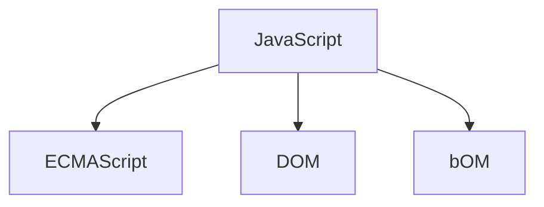

# JavaScript


### JavaScript语言特点

**单线程**

​	为了防止冲突，导致的一些问题，js使用单线程队列，但是有办法将一些js代码重开线程单独进行执行，
​	单线程就意味着，所有任务需要排队，前一个任务结束，才会执行后一个任务。如果前一个任务耗时很长，后一个任务就不得不一直等着。
​	这样所导致的问题是： 如果 JS 执行的时间过长，这样就会造成页面的渲染不连贯，导致页面渲染加载阻塞的感觉。          

  

### 浏览器的划分

**渲染引擎**：

​		**浏览器解析HTML与CSS，俗称内核，一般常说的浏览器内核**

JS**引擎**

​	**也称为解释器，用来对网页中js代码解析，是js代码的运行环境**

​	浏览器本身并不会执行JS代码，而是通过内置 JavaScript 引擎(解释器) 来执行 JS 代码 。JS 引擎执行代码时逐行解释每一句源码（转换为机器语言），然后由计算机去执行，所以 JavaScript 语言归为脚本语言，会逐行解释执行。


### JavaScript的组成




#### ECMAScript

​	ECMAScript 是由ECMA 国际（ 原欧洲计算机制造商协会）进行标准化的一门编程语言，这种语言在万维网上应用广泛，它往往被称为 JavaScript或 JScript，但实际上后两者是 ECMAScript 语言的实现和扩展。

​	ECMAScript：规定了JS的编程语法和基础核心知识，是所有浏览器厂商共同遵守的一套JS语法工业标准。

​	更多参看MDN: [MDN手册](https://developer.mozilla.org/zh-CN/docs/Web/JavaScript/JavaScript_technologies_overview)

#### DOM——文档对象模型

​	**文档对象模型**（DocumentObject Model，简称DOM），是W3C组织推荐的处理可扩展标记语言的标准编程接口。通过 DOM 提供的接口可以对页面上的各种元素进行操作（大小、位置、颜色等）

#### BOM——浏览器对象模型

​	**浏览器对象模型**(Browser Object Model，简称BOM) 是指浏览器对象模型，它提供了独立于内容的、可以与浏览器窗口进行互动的对象结构。通过BOM可以操作浏览器窗口，比如弹出框、控制浏览器跳转、获取分辨率等。


### 引入JavaScript

**行内式**

```html
<input type="button" value="点我试试" onclick="alert('He llo World')" />
```

- 可以将单行或少量 JS 代码写在HTML标签的事件属性中（以 on 开头的属性），如：onclick
- 注意单双引号的使用：在HTML中我们推荐使用双引号, JS 中我们推荐使用单引号
- 可读性差， 在html中编写JS大量代码时，不方便阅读；
- 引号易错，引号多层嵌套匹配时，非常容易弄混；
- 特殊情况下使用

**内嵌式**

```html
<script>
    alert('Hello  World~!');
</script>
```

- 可以将多行JS代码写到 script 标签中

**外部JS文件**

```html
<script src="my.js"></script>
```

- 利于HTML页面代码结构化，把大段 JS代码独立到 HTML 页面之外，既美观，也方便文件级别的复用
- 引用外部 JS文件的 script 标签中间不可以写代码
- 适合于JS 代码量比较大的情况


### JavaScript常用交互语句

| 方法             | 说明                           | 归属   |
| ---------------- | ------------------------------ | ------ |
| alert(msg)       | 浏览器弹出警示框               | 浏览器 |
| console.log(msg) | 浏览器控制台打印输出信息       | 浏览器 |
| prompt(info)     | 浏览器弹出输入框，用户可以输入 | 浏览器 |

> alert() 主要用来显示消息给用户，console.log() 用来给程序员自己看运行时的消息。


